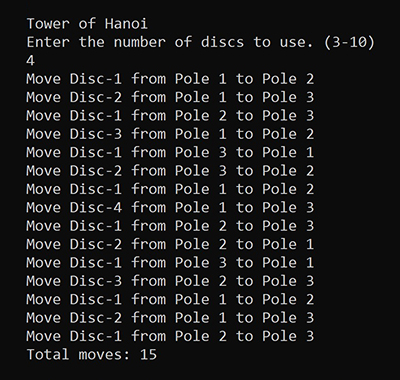

# Tower of Hanoi

Author: Scott Falbo

----

## Description

Classic Tower of Hanoi problem represented as an object.  The `Tower` class include a method to solve the problem, and to display and count each move.

----

### Getting Started

+ Clone the repository to your machine.
  + `git clone https://github.com/scottfalbo/tower-of-hanoi.git`
+ Open the project in your preferred IDE or compile from the terminal.

----

### Visuals

Sample output screen



----

### Basic Tower Structure

Stripped down classes for the `Tower` object.

```
public class Tower
{
  public Poles[] Poles;
  public int Moves;
  public int Discs;

  SolveTower();
  Solve(n, from, to, holder);
}

public class Poles
{
  public Stack<Discs> Pole;
  public in Position;
}

public class Discs
{
  public string Disc;
}
```

----

### Change Log

+ 08/16/2021
  + Created `Tower` structure with `Poles` and `Discs` class objects.
  + Wrote unit tests to ensure the `Tower` structure was properly instantiating.
  + Wrote unit test to check for a proper solution as well as number of moves.
  + Created a recursive `Solve()` method in the tower structure that moves the `Discs` objects and writes each move to the console.

  ----

### Contact

+ [scottfalbo.com](https://scottfalbo.com/)
+ [LinkedIn](https://www.linkedin.com/in/scott-falbo/)
